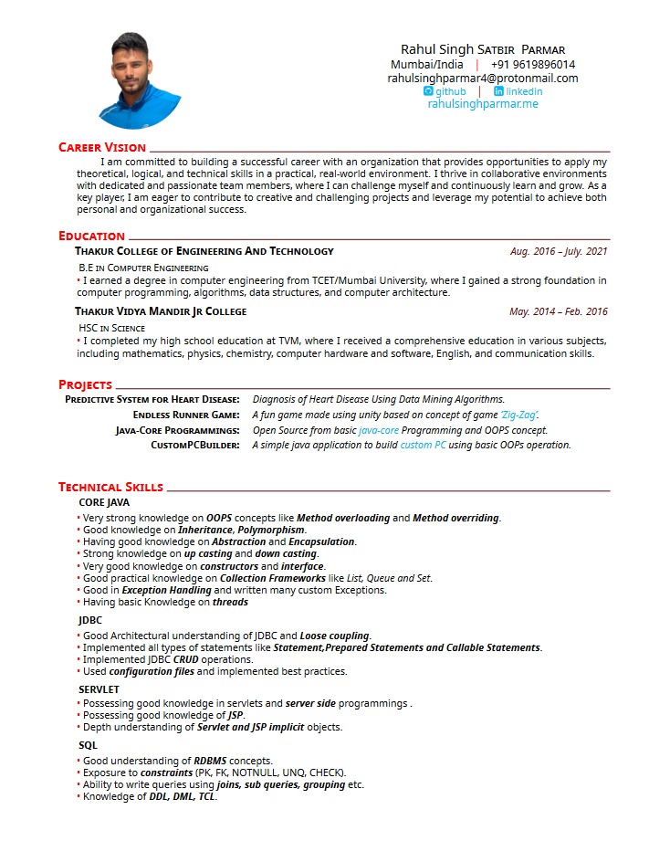
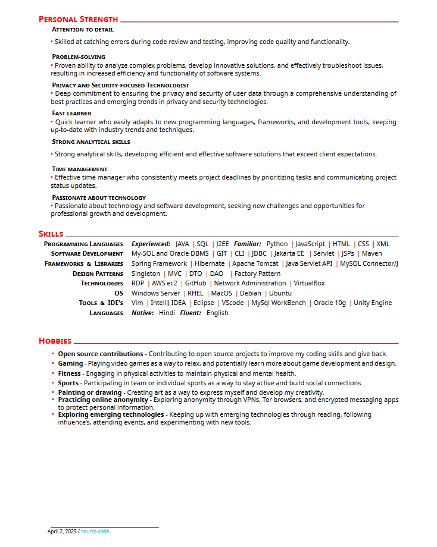

# Latex resume

A single-page, one-column resume for software developers. It uses the base latex templates and fonts to provide ease of use and installation when trying to update the resume. The different sections are clearly documented and custom commands are used to provide consistent formatting. The three main sections in the resume are education, experience, and projects.

## Motivation

I created this template as managing a resume on Google Docs was hard and changing any formatting was too difficult since it had to be applied in multiple places.

Most currently available templates either focus on two columns, or are multiple pages long that didn't work well for career fairs or online applications.A lot of companies today search resumes based on [keywords](http://www.businessinsider.com/most-big-companies-have-a-tracking-system-that-scans-your-resume-for-keywords-2012-1) but at the same time require/prefer a one-page resume, especially for undergraduates.

This template attempts to **look clean**, highlight **details**, be a **single page**, and allow useful **LaTeX templating**.

### Quick start

- You can create your CV using this template on [Overleaf](https://www.overleaf.com/read/nvmkvmzkwrcs) very easily.
- This CV is inspired by the design of [Awesome CV](https://github.com/posquit0/Awesome-CV).
- You might think this as a simplified version. I created this project from scratch to learn Latex and the way I wrote might not be the best latex practices. However, it is easy to play with the high level functions provided in [CV.tex](https://github.com/RahulSinghParmar/resume/blob/master/CV.tex) file without going too much into the detail to have a certain level of expressiveness in your resume. The simplicity also makes it easy to understand what is going on and also enables to make low level customizations.

### Build using Docker

```sh
docker build -t latex .
docker run --rm -i -v "$PWD":/data latex pdflatex Rahul_resume.tex
```

### How does it look?



<!-- 
 -->

### How to use it?

- With minimum effort, you can use the [CV.tex](https://github.com/RahulSinghParmar/resume/blob/master/CV.tex) as it is provided with the high level functions such as ```\datedexperience```, ```\explanation```, ```\explanationdetail``` to add elements to your CV. You can create skill elements with ```\newcommand{\skillname{\createskill{<Skill Category>}{<explanation>}}}``` and finally create the list of skills with ```\createskills{<comma seperated skills list>}```.
- You can also use it for your **cover letter** by just using

   ```
  \setcompanyname{GOOGLE INC.}
  \setcontactperson{Mr.Brown}
  \setclaimedposition{Junior Data Scientist} 
  \coverletter{ %
  <coverlettertext>
  }
  ```

  and deleting the rest of sections.
- Of course, if you want to go further you can check the [rahul_cv.cls](https://github.com/RahulSinghPArmar/resume/blob/master/rahul_cv.cls) file. This is my first latex project so it might be error-prone and not as generic as possible(I still have some warnings that needs to be resolved). However I tried to make it understandable for later contributions.
- You can change the header content with the ```set..``` commands in the beginning and also the the color of the theme.
- Just replace the actual texts with your related education/experience and also don't forget to replace ```\lipsum[1][1-12]\par``` with actual texts. That package is just used for illustration reasons. Since I am not sure what to write to those parts of the resume right now.
  
### TODOS

- [ ] Resolve the warnings.

### Warning

- For Mac users, If you use TexShop, you need to locate the AwesomeFont in your file system and load to your system. It is most probably under ```/usr/local/texlive/2019/texmf-dist/fonts/opentype/public```. Just locate it and double-click install. Then you are good to go.

## License

    Copyright (c) 2017 Rahul Singh Parmar
    Format is MIT but all the data is owned by Rahul Singh Parmar.


    Licensed under the Apache License, Version 2.0 (the "License");
    you may not use this file except in compliance with the License.
    You may obtain a copy of the License at

       http://www.apache.org/licenses/LICENSE-2.0

    Unless required by applicable law or agreed to in writing, software
    distributed under the License is distributed on an "AS IS" BASIS,
    WITHOUT WARRANTIES OR CONDITIONS OF ANY KIND, either express or implied.
    See the License for the specific language governing permissions and
    limitations under the License.
